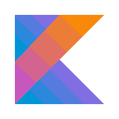

<h1 align="center"> नमस्ते (Namaste), I'm Navneet Gupta  ! </h1>

<h3 align="center">I'm an Android/IOS Developer from India ❤</h3>
  
A 20 Y/O Software Developer🎯 from India. I'm passionate about Full-Stack Android Development.:bar_chart:. I like automating things, exploring scalability problems and improving efficiency and performance. Strong Advocate for 📜 open source, :cloud: Cloud computing, 🚀 DevOps, :new: Innovation and Automation :robot: 

- 🌱 I’m currently learning Jetpack Compose and Flutter
- 👯 I’m looking to collaborate on Android and IOS projects
- 📫 How to reach me: You may follow me on [Instagram](https://www.instagram.com/its__navneet/) 
- 😄 Pronouns: He/Him/His
- ⚡ Fun fact: Jack of all trades , Master of None ! 
 

## 👨‍💻 Languages and Tools

  

 

 

## 🏆 Github Status

 

### Show some ❤️ by starring ⭐ some of the repositories!

